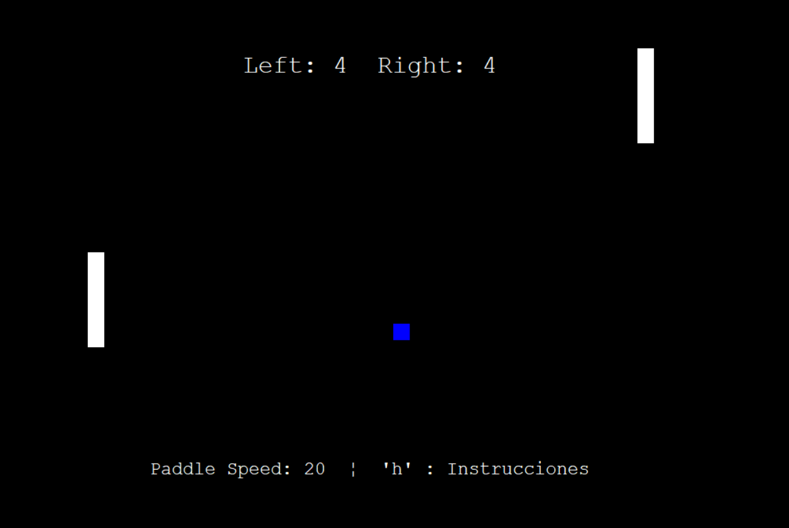

# Pong Game 🎮

Este es un remake del clásico juego de Pong creado en Python utilizando el módulo `turtle`. Es ideal para revivir la nostalgia de los juegos arcade de los años 70, ahora directamente desde tu computadora.

## 🕹️ Características
- Movimiento fluido de las paletas y la pelota.
- Controles intuitivos para dos jugadores.
- Ajuste de velocidad de las paletas directamente desde el juego.
- Interfaz gráfica atractiva con instrucciones integradas.
- Fácil personalización para expandir las funcionalidades.

## 📋 Instrucciones
1. **Mover las paletas**:
   - Jugador 1 (izquierda): Usa las teclas `W` para subir y `S` para bajar.
   - Jugador 2 (derecha): Usa las teclas de flecha `Arriba` y `Abajo` para mover la paleta.
2. **Ajustar la velocidad de las paletas**:
   - Pulsa `I` para aumentar la velocidad.
   - Pulsa `K` para disminuir la velocidad.
3. **Ver instrucciones**:
   - Pulsa `H` para mostrar las instrucciones en pantalla.
   - Pulsa `Esc` para cerrar las instrucciones.
4. **Ganar el juego**:
   - El primer jugador en alcanzar 5 puntos gana la partida.

## 🚀 Cómo jugar
### Requisitos
- Python 3.6 o superior.
- Módulo `turtle` (viene preinstalado con Python).

### Ejecución
1. Descarga el código fuente desde este repositorio.
2. Asegúrate de tener Python instalado en tu sistema. [Descargar Python](https://www.python.org/).
3. Ejecuta el archivo principal del juego con:
   ```bash
   python pong_game.py

### 🛠️ Personalización

Si deseas modificar el juego, puedes ajustar:

**- Velocidad de la pelota**: Edita las variables `ball.dx` y `ball.dy`.
**- Tamaño de las paletas**: Cambia `stretch_wid` y `stretch_len` de las paletas.
**- Condiciones de victoria**: Cambia el valor de puntos necesarios para ganar.

### 🖼️ Vista previa




### 📜 Licencia

Este proyecto está disponible bajo la Licencia MIT. Puedes usar, modificar y distribuir este proyecto libremente.
